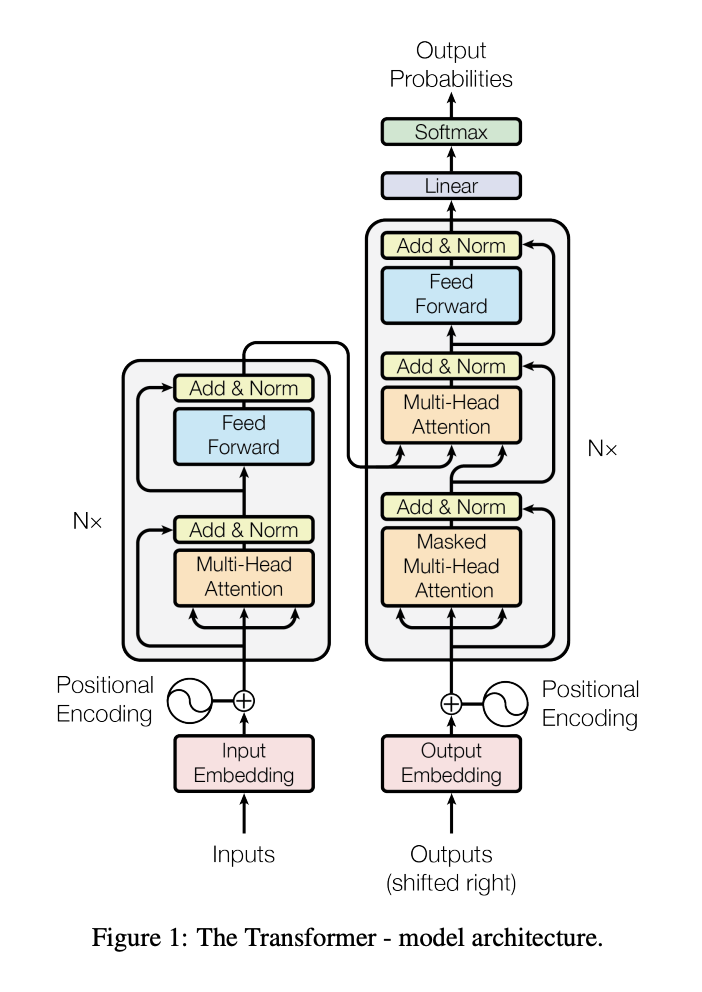

# Attension is all you need (Transformer)

### Origin papaer at : https://arxiv.org/abs/1706.03762

##### Abstract

The dominant sequence transduction models are based on complex recurrent or convolutional neural networks that include an encoder and a decoder.

> 현재 지배적으로 사용되고있는 시퀀스 변환 모델들은 인코더와 디코더를 포함하는 CNN(합성곱 신경망)구조 이거나, 복잡한 RNN(순환 신경망) 구조 이다.

The best performing models also connect the encoder and decoder through an attention mechanism.

> 가장 좋은 성능을 내고 있는 모델들 역시 인코더와 디코더를 어텐션 기법을 활용하여 연결 시키고있다.

We propose a new simple network architecture, the Transformer, based solely on attention mechanisms, dispensing with recurrence and convolutions entirely.

> 우리는 recurrence(순환)와 convolution(합성곱)을 완전히 배제하고, 어텐션 기법에만 기초한 Transformer라는 새로운 간단한 신경망 구조를 제안한다. 

Experiments on two machine translation tasks show these models to be superior in quality while being more parallelizable and requiring significantly less time to train.

> 두가지 기계학습 과제에 대한 실험은 이 모델이 병렬처리가 더 용이하고, 훈련에 있어 확연하게 적은시간을 필요로 하며, 질적으로 더 뛰어남을 보여준다.

Our model achieves 28.4 BLEU on the WMT 2014 Englishto-German translation task, improving over the existing best results, including ensembles, by over 2 BLEU.

> 우리의 모델은  WMT 2014 Englishto-German translation task에서 28.4 BLEU점수를 기록하면서 기존 앙상블기법을 포함한 최고의 점수를 2 BLEU만큼 갱신하였다.

On the WMT 2014 English-to-French translation task, our model establishes a new single-model state-of-the-art BLEU score of 41.8 after training for 3.5 days on eight GPUs, a small fraction of the training costs of the best models from the literature.

> WMT 2014 English-to-French translation task에서는, 기록되어있는 최고의 모델들의 훈련비용과 비교하여 매우 적은 비용인, 3.5일간의 8개의 GPU를 활용한 훈련 과정을 거친 우리의 모델이 단일모델로서 41.8 BLEU 점수를 기록하며 SOTA(당시 시점 최고 모델) 모델로 선정되었다.

We show that the Transformer generalizes well to other tasks by applying it successfully to English constituency parsing both with large and limited training data.

> 우리는 Transformer가 다른 과제에도 적합하게 일반화 되는것을 제한된 데이터 및 방대한 양의 데이터응 활용한 영어 구성 구문 분석에 성공적으로 적용하여 증명 하였다.

 

##### Introduction

Recurrent neural networks, long short-term memory and gated recurrent neural networks in particular, have been firmly established as state of the art approaches in sequence modeling and transduction problems such as language modeling and machine translation.

> 순환 신경망, 특히 장단기 기억(LSTM) 및 게이트드 순환 신경망(GRU : Gated Recurrent Unit)은 일련의 모델링 및 언어 모델링, 기계 번역과 같은 변환 문제에서 최첨단 방법으로 확립되었다.

Numerous efforts have since continued to push the boundaries of recurrent language models and encoder-decoder architectures.

> 이후로 순환 언어 모델과 인코더 디코더 구조의 한계를 넓히기 위하여 많은 노력이 계속해서 이루어지고 있다.

Recurrent models typically factor computation along the symbol positions of the input and output sequences.

> 순환 모델은 일반적으로 입력 및 출력 시퀀스에 대한 위치 상징(위치정보)를 따라서 계산이 이루어진다.

Aligning the positions to steps in computation time, they generate a sequence of hidden states $h_t$, as a function of the previous hidden state $h_{t-1}$ and the input for position $t$.

> 연산과정에서 시간의 흐름에 따라 위치를 정렬하여, 이전 시퀀스의 은닉 상태 $h_{t-1}$와 현재 위치(시점) $t$ 에서의 입력에 대한 함수를 통하여 숨겨진 상태 $h_t$의 시퀀스를 생성한다.

 This inherently sequential nature precludes parallelization within training examples, which becomes critical at longer sequence lengths, as memory constraints limit batching across examples.


```null

```

